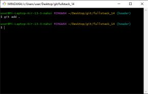

<html>
<head>
<title>Инструкция GitHub. Автор: Войтенков Дмитрий</title>
<meta name="decription" content="Краткая инструкция по использованию GitHub">
</head>
<body>
<ul class="main-menu">
    <li class="active"><a href="index.htm">GitHub: что это и для чего</a></li>
    <li class="menu-children">
        <a href="#url">Основные команды Git</a>
        <ul>
            <li><a href="add.htm">Add</a></li>
            <li><a href="commit.htm">Commit</a></li>
<li><a href="push.htm">Push</a></li>
           
        </ul>
    </li>
    <li><a href="branches.htm">Ветки проектов</a></li>
   <li><a href="ignore.htm">Игнор-лист github</a></li>
    <li></li>
    <li></li>       
</ul>

Команда add в GitHub – это одна из самых часто используемых команд в системе контроля версий Git. Она позволяет добавлять файлы в индекс, чтобы они были готовы к коммиту.

Чтобы использовать команду add, необходимо открыть терминал и перейти в директорию проекта. Затем можно добавить все файлы в индекс с помощью команды:

<b>git add .</b>

Эта команда добавляет все файлы в текущей директории и ее поддиректориях.

Если нужно добавить только определенный файл, то его имя можно указать после команды add:

<b><i>git add file.txt</i></b>

Также можно добавить несколько файлов, перечислив их через пробел:

<b><i>git add file1.txt file2.txt</i></b>

Если файл уже был добавлен в индекс, то повторный вызов команды add не приведет к его дублированию. Однако, если файл был изменен после последнего коммита, то его измененная версия будет добавлена в индекс.

Если нужно удалить файл из индекса, то можно использовать команду:

<b><i>git reset file.txt</i></b>

Эта команда удаляет файл из индекса, но не удаляет его из рабочей директории.

Команда add – это базовая команда Git, которая позволяет добавлять файлы в индекс. Она является необходимой для создания <a href="commit.htm"><b>коммитов</b></a> и сохранения изменений в репозитории. Поэтому ее использование должно быть хорошо знакомо всем разработчикам, работающим с Git и GitHub.

