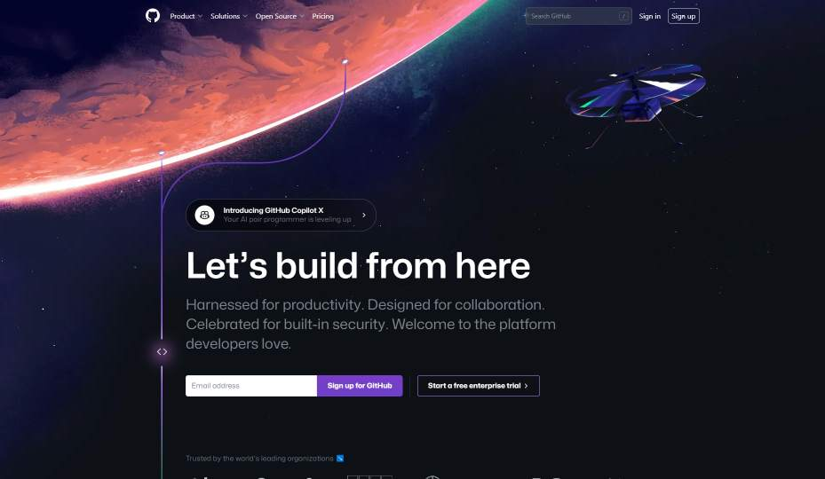

<html>
<head>
<title>Инструкция GitHub. Автор: Войтенков Дмитрий</title>
<meta name="decription" content="Краткая инструкция по использованию GitHub">
</head>
<body>
<ul class="main-menu">
    <li class="active"><a href="#null">GitHub: что это и для чего</a></li>
    <li class="menu-children">
        <a href="#url">Основные команды Git</a>
        <ul>
            <li><a href="add.htm">Add</a></li>
            <li><a href="commit.htm">Commit</a></li>
<li><a href="push.htm">Push</a></li>
           
        </ul>
    </li>
    <li><a href="branches.htm">Ветки проектов</a></li>
<li><a href="ignore.htm">Игнор-лист GitHub</a></li>
    <li></li>
    <li></li>       
</ul>

<b>
GitHub - это веб-платформа для хранения, управления и совместной работы над проектами с открытым исходным кодом.</b>

 Она используется разработчиками по всему миру для хранения своих проектов, контроля версий и управления задачами. Каждый разработчик может создать свой репозиторий на GitHub и делиться им со всем миром.

GitHub используется для совместной работы над проектами, ведения их истории и управления задачами. Разработчики могут работать над одним проектом, делиться своими наработками и комментировать изменения других разработчиков. GitHub также позволяет создавать запросы на включение изменений (pull requests), что позволяет участникам проекта обсуждать и проверять изменения перед их включением в основную ветку проекта. Более подробно про ветки вы можете прочитать <a href="">здесь</a>

GitHub используют как крупные компании, так и небольшие команды разработчиков. Это платформа, которая позволяет легко и удобно работать с проектами, контролировать изменения и управлять задачами. GitHub также является открытым ресурсом, что позволяет любому желающему внести свой вклад в развитие проектов.

<b><i>

Одним из главных преимуществ GitHub является возможность контроля версий.</b></i> Разработчики могут легко отслеживать изменения в проекте и вернуться к предыдущей версии, если что-то пошло не так. Это позволяет избежать ошибок и упрощает совместную работу над проектом.

Также GitHub предоставляет множество инструментов для управления задачами и коммуникации между участниками проекта. Разработчики могут создавать задачи, назначать их на других участников и отслеживать их выполнение. Кроме того, GitHub предоставляет возможность общения между участниками проекта через комментарии и обсуждения.

В целом, GitHub - это платформа, которая значительно упрощает совместную работу над проектами с открытым исходным кодом. Она позволяет разработчикам легко контролировать версии проекта, управлять задачами и коммуникацией между участниками. GitHub является незаменимым инструментом для разработки программного обеспечения в современном мире.

 </body>